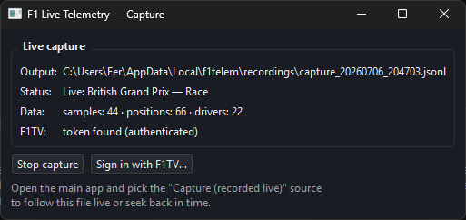

# F1 Live Telemetry

A Windows desktop app that charts **Formula 1 telemetry live** (speed, throttle,
brake, RPM, gear) for one or several cars at once, with **distance on the X
axis** and one series per driver. Built with
[Fast-F1](https://github.com/theOehrly/Fast-F1), PySide6 and pyqtgraph.


**Times / Gap** — gap to a reference driver over the whole race, tyre
degradation per stint and the timing tower with pit stops and averages:


**Quali comparison** — live laps against a target lap, with the cumulative
delta trace and per-sector/microsector delta cards updating in real time:


## Modes

| Mode | Behaviour |
|------|-----------|
| **Race** | Sliding window configurable in laps (½ to 20 or the whole session; default 1), plus free space on the right so the latest values and each series' label stay visible. The X axis is the **track position** ((lap − 1) × lap length + lap meter), so the same corner falls on the same vertical for every car: braking points line up even when a car runs behind. |
| **Race 2** | Fixed X axis from 0 to the last meter of the lap. Each series overwrites ("eats") its own previous-lap line as it advances, with a visible gap ahead of each car's cursor. |
| **Quali** | Comparison of the current lap against a **target lap** (any completed lap of any driver). Three levels: the channel traces (dashed target + live current laps), the **cumulative delta trace** (X = distance, Y = seconds gained/lost vs the target at every meter, X axes linked), and **per-driver cards** (up to 4, in a 2-column grid) with the total lap delta in large type and one row per sector: the sector chip on the left and its 8 microsectors aligned next to it — no horizontal scrolling; green = doing better, red = worse, and the most recently crossed microsector is highlighted. |
| **Times / Gap** | Gap chart against a reference driver (marked "(ref)" in the legend; X = **track position**, with "total distance / L\<lap\> +\<meters\>" ticks and a vertical line at every lap boundary; window configurable from ½ to 20 laps or the whole session; Y = seconds, **+ = slower than the reference at the same position, − = faster**) plus comparison tables ordered by track position: summary (P1..Pn, current lap, last, best, S1-S3, gap), lap times per driver, microsector deltas (24 splits, green/red cells) and per-corner minimum speeds. Sectors and microsectors are **rolling** (current lap in real time; until crossed, the value from one lap ago, dimmed) and each driver's most recently completed microsector is highlighted. |

## Data sources

- **Demo (synthetic)** — 6 simulated cars on a fictional circuit. No network
  needed; try the app and all its modes any time.
- **Replay (Fast-F1 historical)** — replays any real session (2018 onwards) as
  if it were live, with a speed multiplier (x1 to x25). The first load of a
  session downloads data (may take a few minutes); it is cached afterwards.
- **Live (F1 Live Timing)** — SignalR Core client for
  `livetiming.formula1.com/signalrcore`. It decodes `CarData.z` (speed, RPM,
  gear, throttle, brake, DRS at ~4 Hz per car) and `Position.z`, integrates
  speed to obtain distance and takes lap numbers from `TimingData`. **Data
  only flows while an official session is running**, and the full stream
  requires an **F1TV subscription token** (the same one Fast-F1 uses; sign in
  from the capture window). Every message is recorded to
  `%LOCALAPPDATA%\f1telem\recordings\`.
- **Capture (recorded live)** — follows a capture file written by the
  **capturer** with minimal delay (new lines are decoded as soon as they hit
  the disk, ~50 ms). The timeline lets you seek back anywhere in the session
  while the capture keeps growing, and the red **LIVE** button jumps back to
  the latest data.

## Capturer

A companion app that ONLY captures the live stream to a file, so the
visualizer (this app, even multiple instances) can follow it live or rewind
without touching the network connection:

```powershell
F1LiveTelemetry.exe --capture     # or: python -m f1telem --capture
```

It shows the output file, connection status and data counters, and offers
**Sign in with F1TV…** (browser flow, token shared with Fast-F1). Then open
the main app and pick the *Capture (recorded live)* source: it automatically
follows the most recent capture file.



## Features

- **Detachable panels**: every panel — timing tower, track map, Times/Gap
  tables, Quali delta cards, each mode's central view (Race, Race 2,
  Quali, Times/Gap), data source, driver selection, Mode box and the
  timeline — has a small title bar with a ⧉ button that pops it out into
  **its own window**, freely movable and resizable, plus a 📌 **pin**
  button that makes the floating window frameless, always-on-top and
  immovable (ideal over a broadcast), and a ⇱ button to dock it back where
  it was (a floating central view leaves a dock-back placeholder in its
  mode). The **Panels…** button chooses which panels are visible — the
  choice is global and independent of the active mode, so **any
  combination of panels** can be assembled; floating panels stay open
  across modes and keep refreshing (e.g. the timing tables while watching
  the Race chart). The whole layout is **persistent**: window geometry,
  splitters and each panel's docked/floating state, position, size and
  pinned flag are reapplied exactly as they were on the next start.
- **Tower font size**: A− / A+ buttons in the tower header scale its font
  and row heights (persisted).
- **Pause and hot speed change** (demo/replay): the ⏸ button next to the
  timeline pauses/resumes, and the speed selector can be changed at any
  moment without reconnecting.
- **Timeline** (replay only): a slider below the charts seeks to any point of
  the session; jumping rebuilds the whole state up to that instant (drivers,
  selection and the target lap are kept) and playback continues from there. A
  **ruler marks the start of every lap** (numbered adaptively); clicking a
  mark jumps straight to that lap. Pit stops show as diamonds (driver color),
  flag/SC periods as colored bands and rain as a thin blue stripe. The
  timeline stays active after the replay ends so you can seek back.
- **Timing tower** (right panel, above the map): broadcast-style rows —
  position and driver code on the team color, positions gained/lost, DRS
  status, gear/RPM/speed, **LAST/BEST pills** (purple = session best,
  green = personal best), interval to the car ahead and gap to the leader
  (or "+nL" when lapped), plus the **mini-sector dashes** with the sector
  times below (official feed segments when live; computed against personal
  and session bests elsewhere). Each row also shows the pit-stop count
  ("P n" next to the interval) and an **AVG5/AVG10** column (average of the
  last 5/10 laps, excluding pit in/out laps). The header shows the leader's
  lap, a track-status badge and the weather. Narrow panels drop the outer
  blocks first — widen the splitter to see everything. Gaps only compute
  with real positions: at the
  start, telemetry does not know each car's exact grid slot, so gaps begin at
  the end of sector 1 of lap 1 — the first fixed point common to all cars —
  using a grid offset estimated by projecting car positions onto the track.
- **Weather**: air and track temperature, wind and rain in the status bar
  (synchronized with the replayed instant).
- **Browsable session picker**: the GP field is a combo with the year's
  calendar (loaded in the background via Fast-F1); free typing still works.
- **Stint summary** (Degradation tab): average pace and degradation slope
  (s/lap, linear fit) per stint and compound, next to the lap-time vs
  tyre-age chart (one series per stint, colored by compound).
- **Tyres and strategy** (replay): the "By lap" table tints every cell by
  compound, adds the tyre age in parentheses and marks pit-stop laps with
  "P".
- **Flags and Safety Car**: background bands on the gap chart and the
  timeline, and the tower's header badge while yellow/SC/VSC/red is active.
  While a marshal sector is under yellow flag, that stretch of the **track
  map is painted yellow** (replay: race control messages + Fast-F1 marshal
  sectors).
- **Official mini-sectors** (Times/Gap → "Official µ" tab): the colored
  dashes of the official timing feed, per driver and in track order —
  purple = session best, green = personal best, yellow = completed without
  improving, blue = pit lane. Carried by the Live and Capture sources
  (existing capture files already contain them).
- **Real corners** ("Corners" tab): minimum speed at each numbered corner of
  the circuit (T1, T2, … from Fast-F1 `circuit_info`), rolling over the
  current lap and colored against the reference; corners are also labelled on
  the map.
- **Track map** (right panel, below the tower): the track outline with each
  selected driver's current position (dot + code + 5-second trail fading
  toward its tail, toggleable), synchronized with the same clock as the
  charts. In demo and replay the outline is immediate; live, it builds itself
  once a car completes a lap (`Position.z` feed).
- **Chart ↔ map correlation**: hovering a chart shows a ring on the map at
  the corresponding track point; hovering the map outline shows a vertical
  reference line on the active chart at the corresponding lap meter.
- **Chart interactions**: crosshair tooltip with every visible series' value
  at the cursor; double-click a line to hide it (double-click empty space to
  restore); optional text labels on significant peaks (straight-end top
  speeds above, corner minimum speeds below); the **X window** selector sets
  the axis width in laps for Race and Times/Gap (each mode remembers its
  own).
- **Smooth rendering**: 30 fps refresh; sliding windows and each series' tip
  interpolate between telemetry batches (never predicting ahead of real
  data), so lines draw continuously and precisely.
## Usage (development)

```powershell
python -m venv .venv
.venv\Scripts\pip install -r requirements.txt
.\run.ps1
```

1. Pick a source and press **Connect**.
2. Check the drivers you want to chart — the list is alphabetical and has a
   **Select all** (teammates share the team color and are distinguished by
   line style).
3. Switch mode and channel at will; in **Quali**, pick the target driver and
   lap (each lap shows its time) and press **Set**.

## Windows executable

```powershell
.\build.ps1
```

Produces `dist\F1LiveTelemetry\F1LiveTelemetry.exe` (self-contained folder,
no Python required) and `dist\F1LiveTelemetry-win64.zip`, ready to upload as
the GitHub release asset.

## Automatic updates

Both the visualizer and the capturer check the
[latest GitHub release](https://github.com/frborda/F1-Live-Telemetry/releases)
shortly after startup, and on demand via the **vX.Y.Z** button in the status
bar (bottom-right corner of each window). When a newer version exists, a
dialog shows its release notes and offers **Download and install**: the zip
is downloaded to `%LOCALAPPDATA%\f1telem\updates`, verified against the
sha256 digest published by GitHub, and an unattended script swaps the
install folder once every running instance closes, then relaunches the app —
with automatic rollback if the copy fails (see `update.log` in that folder).
**Skip this version** silences that release; the startup check can be turned
off from the same dialog (`updates.check_on_startup` in `config.json`).
Running from source only opens the releases page.

Publishing a release: bump `__version__` in `src/f1telem/__init__.py`, run
`.\build.ps1`, create a GitHub release tagged `vX.Y.Z` and upload
`dist\F1LiveTelemetry-win64.zip` (keep that asset name).

## Tests

```powershell
$env:QT_QPA_PLATFORM = "offscreen"
.venv\Scripts\python tests\smoke.py         # full app with the demo source + live decoder
.venv\Scripts\python tests\replay_check.py  # real Fast-F1 integration (downloads data)
.venv\Scripts\python tests\updater_check.py # updater: versions, zip layout, install script
.venv\Scripts\python tests\sector_bounds_check.py # official sectors: decode, bounds, anchoring
```

## Technical notes

- Live distance is integrated trapezoidally from speed; lap length is
  estimated as the median of observed laps (in replay it is computed exactly
  from Fast-F1 data).
- Lap/sector/microsector times are interpolated from the crossing instant of
  24 distance marks per lap. With ~4-5 Hz telemetry the accuracy is about
  ±0.1 s — good for comparisons, not official timing. When official sector
  times are available (replay: Fast-F1 laps; live/capture: the timing feed),
  the app locates the **real S1/S2 boundaries** on track — interpolating
  where each car was at the instant it set each sector time, median across
  laps and drivers — and anchors the marks to them; each microsector is 1/8
  of its sector. Each lap's marks are also scaled to the length it really
  integrated between finish-line crossings. On top of that, **as soon as
  each official sector/lap time is published, the tables show that exact
  value** — interpolation only covers what is not timed yet (the rolling
  current lap and microsectors). In replay all timed laps therefore match
  the official timing to the millisecond (verified against a full
  qualifying: 22/22 classification positions identical); live, official
  values arrive seconds after each crossing, and the official S1 is also
  used to re-anchor each lap's frame, cutting the error the feed latency
  introduces in the interpolated values. Without official sector times,
  sectors fall back to distance thirds of the lap. The gap between cars is the time difference
  when passing the same track position, with each lap anchored to its own
  finish-line crossing.
- Fast-F1 cache: `%LOCALAPPDATA%\f1telem\cache`. Settings:
  `%APPDATA%\f1telem\config.json`.

## Credits

- **[Fast-F1](https://github.com/theOehrly/Fast-F1)** by
  [@theOehrly](https://github.com/theOehrly) — this project relies on Fast-F1
  for historical session data, lap and telemetry parsing, circuit info,
  weather, race control messages and the event schedule. Huge thanks to its
  author and contributors.
- Live data comes from the public F1 live timing stream.

## Disclaimer

This is an unofficial project and is not associated in any way with the
Formula 1 companies. F1, FORMULA ONE, FORMULA 1, FIA FORMULA ONE WORLD
CHAMPIONSHIP, GRAND PRIX and related marks are trademarks of Formula One
Licensing B.V.
